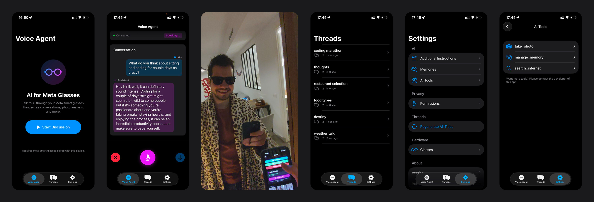

# Meta Glasses iOS OpenAI



Voice AI assistant for **Meta smart glasses** powered by **OpenAI Realtime API**.

Talk hands-free through your glasses. The AI hears you, sees what you see, and responds in natural voice.

## Features

- 🎙️ **Voice conversations** — talk naturally through glasses mic, hear responses in speakers
- 💬 **Conversation history** — browse and continue past discussions

**Tools** the AI can use:
- 📷 `take_photo` — see through glasses camera ("what am I looking at?")
- 🌐 `search_internet` — real-time news, weather, prices, sports scores (requires Perplexity API key)
- 🧠 `manage_memory` — remember things about you across conversations

## Before You Start

> ⚠️ **Developer Mode Required**  
> Your Meta glasses must have **Developer Mode enabled** before this app can connect to them.  
> Without this, the app will build successfully but won't see your glasses.
>
> **How to enable:**  
> 1. Open **Meta AI** app on your phone  
> 2. Go to **Settings** → **App Info**  
> 3. Tap **App version** number **five times quickly** — this reveals the Developer Mode toggle  
> 4. Enable the **Developer Mode** toggle  
> 5. Tap **Enable** to confirm
>
> See [Meta Wearables Setup Guide](https://wearables.developer.meta.com/docs/getting-started-toolkit) for detailed instructions.

## Quick Start

### 1. Clone and configure

```bash
git clone https://github.com/kirill-markin/meta-glasses-ios-openai.git
cd meta-glasses-ios-openai

# Copy config templates
cp Config.xcconfig.example Config.xcconfig
cp meta-glasses-ios-openai/Config.swift.example meta-glasses-ios-openai/Config.swift
```

### 2. Fill in credentials

The project requires two config files (both are gitignored for security):

| Required file | Example template |
|---------------|------------------|
| `Config.xcconfig` | [`Config.xcconfig.example`](Config.xcconfig.example) |
| `meta-glasses-ios-openai/Config.swift` | [`Config.swift.example`](meta-glasses-ios-openai/Config.swift.example) |

Copy each `.example` file (remove the `.example` suffix) and fill in your values:

**Config.xcconfig** — Xcode build settings (required):
```
PRODUCT_BUNDLE_IDENTIFIER = com.yourcompany.metaglasses
DEVELOPMENT_TEAM = YOUR_TEAM_ID_HERE
META_APP_ID = YOUR_META_APP_ID_HERE
```

**Config.swift** — API keys (optional at build time):
```swift
static let openAIAPIKey = ""              // Optional: configure in app or set here as default
static let perplexityAPIKey = ""          // Optional: leave empty to disable search
```

> 💡 **API keys can be configured in-app.** You can leave `Config.swift` keys empty and add them later in Settings → AI → Models (OpenAI) or AI Tools (Perplexity). Keys set in `Config.swift` are used as defaults on first launch.

### 3. Build and run

Open `meta-glasses-ios-openai.xcodeproj` in Xcode → Run on physical iOS device.

> ⚠️ Simulator won't work — Bluetooth is required for glasses connection.

## Requirements

| What | Where to get |
|------|--------------|
| Physical iOS device | — |
| Meta smart glasses | Paired via Meta AI app |
| Meta App ID | [developer.meta.com](https://developer.meta.com) |
| OpenAI API key | [platform.openai.com/api-keys](https://platform.openai.com/api-keys) |
| Perplexity API key *(optional)* | [perplexity.ai/settings/api](https://www.perplexity.ai/settings/api) |

> 💡 **API keys can be added in the app.** You don't need to set them at build time — configure them in Settings → AI → Models (OpenAI) or AI Tools → search_internet (Perplexity).

> 💡 **Perplexity API key is optional.** Without it, the `search_internet` tool will be disabled but everything else works normally.

> 💡 Don't forget to enable Developer Mode on your glasses — see [Before You Start](#before-you-start) above.

## Tech Stack

- Swift 5 / SwiftUI
- [Meta Wearables SDK](https://github.com/facebook/meta-wearables-dat-ios) (MWDATCore, MWDATCamera)
- [OpenAI Realtime API](https://platform.openai.com/docs/guides/realtime) (WebSocket)
- Bluetooth HFP for glasses audio

## Project Structure

```
meta-glasses-ios-openai/
├── VoiceAgentView.swift    # Main voice UI
├── RealtimeAPIClient.swift # OpenAI WebSocket + audio
├── GlassesManager.swift    # Meta SDK integration
├── ThreadsManager.swift    # Conversation history
├── SettingsManager.swift   # User prompt & memories
└── AudioManager.swift      # Bluetooth HFP audio
```

## Siri Voice Activation

You can start the voice assistant hands-free using Siri:

| Action | What to say |
|--------|-------------|
| **Start session** | "Hey Siri, start session with Glasses" |
| **Stop session** | "Stop session" *(said to the AI, not Siri)* |

**Limitation:** "Hey Siri" is heard by your iPhone, not the glasses. If your phone is too far away or in a bag, Siri won't hear you. The glasses microphone cannot trigger Siri — this is an iOS limitation.

*Future: When Meta enables custom button actions on glasses, this can be improved.*

## License

[MIT](LICENSE)

## Author

**Kirill Markin** — [github.com/kirill-markin](https://github.com/kirill-markin)
